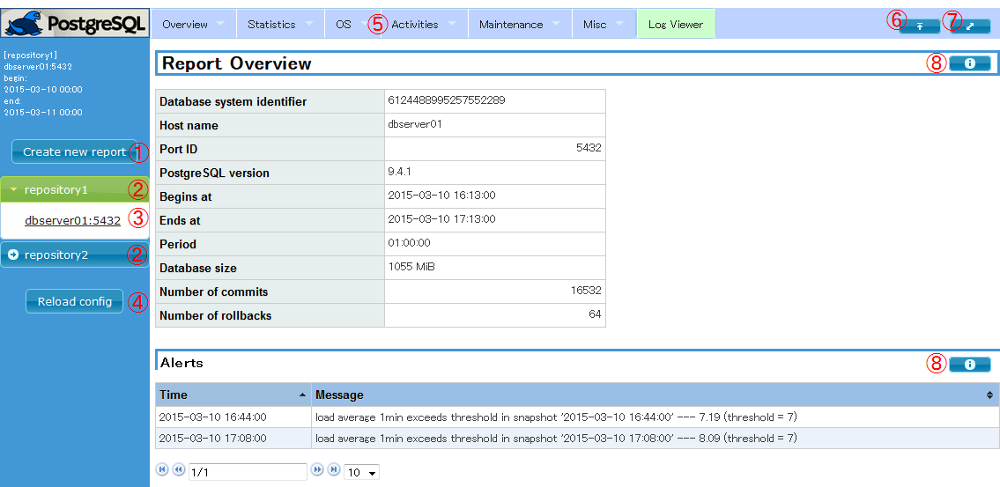

1.  [pg_stats_reporterとは](#pg_stats_reporterとは)
2.  [機能概要](#機能概要)
    1.  [Webレポート機能](#webレポート機能)
    2.  [コマンドライン機能](#コマンドライン機能)
3.  [インストール](#インストール)
    1.  [動作確認環境](#動作確認環境)
    2.  [パッケージのインストール](#パッケージのインストール)
    3.  [初期設定](#初期設定)
    4.  [動作確認](#動作確認)
4.  [操作方法](#操作方法)
    1.  [Webレポート機能の操作方法](#webレポート機能の操作方法)
    2.  [コマンドライン機能の操作方法](#コマンドライン機能の操作方法)
5.  [アンインストール](#アンインストール)
6.  [設定ファイル](#設定ファイル)
7.  [使用上の注意と制約](#使用上の注意と制約)
8.  [よくあるQ\&A](#よくあるqa)
9.  [pg_stats_reporter13からの変更点](#pg_stats_reporter13からの変更点)
10. [関連項目](#関連項目)
11. [謝辞](#謝辞)

# pg_stats_reporter 14

## pg_stats_reporterとは

[pg_statsinfo 14](https://github.com/ossc-db/pg_statsinfo/)が収集した統計情報を元に、PostgreSQL
サーバの利用統計情報をHTML形式のグラフィカルなレポートで出力します。

当ツールで作成したレポートの例は[こちら](http://pgstatsinfo.sourceforge.net/documents/reporter14/doc/files/report_sample.html)をご覧ください。

pg_statsinfo 14 および pg_stats_reporter 14 以降は GitHub にて公開しています。pg_stats_reporter 13 以前の情報については、[SourceForge](http://pgstatsinfo.sourceforge.net/index_ja.html)をご覧ください。

## 機能概要

pg_stats_reporter は pg_statsinfo
が統計情報(以降、スナップショットと呼びます)を蓄積しているデータベース(以降、リポジトリDBと呼びます)からレポート作成に必要な情報を取得し、HTML形式のグラフィカルなレポートを作成します。

pg_stats_reporter を利用する際には、以下の２つのレポート作成機能があります。

### webレポート機能

Webレポート機能では、Apache HTTP Server と連携して pg_stats_reporter が動作します。
WEBサーバにブラウザを利用してアクセスすることで、ブラウザ上での操作によりレポートを作成することが可能です。

Webレポート機能が作成するレポートの種類を以下に示します。

  - 性能レポート  
    データベースの性能に関する統計情報やOSリソースの使用状況などが表示されます。
  - ログレポート  
    データベースのログおよび pg_statsinfo で検出したアラートが表示されます。また、特定のログを検索することができます。

### コマンドライン機能

コマンドライン機能では、端末上でのコマンド実行により性能レポートを作成することができます。  
コマンドライン機能の利用には Apache HTTP Server を必要としません。何らかの理由でApache HTTP
Serverを実行出来ない場合や、crond等で一定期間のレポートを日々作成したい場合に特にお勧めします。

## インストール

pg_stats_reporter
のインストールについて説明します。インストールパッケージは[こちら](https://github.com/ossc-db/pg_stats_reporter/releases)からダウンロードしてください。
ソースセットからインストールする場合は、ソースセットに同梱されている INSTALL.ja ファイルを参照してください。

### 動作確認環境

  - pg_statsinfo
    バージョン 14

  - 動作確認済みPHP  
    バージョン 5.4.16 (RHEL 7.9 同梱のもの)、7.2.24 (RHEL 8.5 同梱のもの)

  - 動作確認済みOS  
    RHEL 7.9、8.5

  - 動作確認済みブラウザ  
    Firefox : 91.4.0esr、96.0
    
    Microsoft Edge : 97.0.1072.55

  - 動作確認済みHTTP Server  
    Apache HTTP Server : 2.4

  - 利用ライブラリ (pg_stats_reporter のインストールパッケージに同梱)
    
      - jQuery : 3.6.0
      - jQuery UI : 1.13.0
      - jquery-ui-timepicker-addon : 1.6.3
      - dygraphs JavaScript Visualization Library : 2.1.0
      - jqPlot : 1.0.9 d96a669
      - tablesorter : 2.31.3
      - Superfish : 1.7.10
      - Smarty : 3.1.43

### パッケージのインストール

全ての機能を使用する場合は「フルインストール」の手順を、コマンドライン機能のみを使用する場合は「コマンドライン機能のみ」の手順を、ルートユーザで実行してください。  
php-intl が未インストールの状態でも動作しますが、表示言語の自動設定が機能しなくなります。  
※ソースセットからインストールする場合の手順は、ソースセットに同梱されている INSTALL.ja ファイルを参照してください。
※RHEL 7でのphp-intl のRPMパッケージの入手は、Red Hatカスタマーポータルのサブスクリプション管理サービスを用いる必要があります。

#### フルインストール

##### RHEL 7

    # yum install pg_stats_reporter-14.0-1.el7.noarch.rpm php-intl

##### RHEL 8

    # dnf install pg_stats_reporter-14.0-1.el8.noarch.rpm php-intl

#### コマンドライン機能のみ

pg_stats_reporterのrpmは、依存関係にhttpdが含まれています。そのためインストールする際は、--nodepsを指定してrpmコマンドを実行します。

##### RHEL 7

    # yum install php-pgsql php-intl php-cli
    # rpm -ivh --nodeps pg_stats_reporter-14.0-1.el7.noarch.rpm

##### RHEL 8

    # dnf install php-pgsql php-intl php-cli php-xml
    # rpm -ivh --nodeps pg_stats_reporter-14.0-1.el8.noarch.rpm

### 初期設定

#### リポジトリDBの起動

リポジトリDBが停止している場合は、リポジトリDBを起動します。

#### リポジトリDBの設定

設定ファイルを編集し、リポジトリDBへの接続情報を設定します。設定ファイルの説明は[こちら](#設定ファイル)を参照してください。
設定例は[こちら](files/pg_stats_reporter.ini.sample)を参照してください。

#### HTTP Serverの起動

Webレポート機能を使用する場合は、HTTP Server を起動します。

    # systemctl start httpd.service

OS 起動時に HTTP Server を自動的に起動させる場合は以下のコマンドを実行します。

    # systemctl enable httpd.service

### 動作確認

#### webレポート機能の動作確認

[Webレポート機能の操作方法](#Webレポート機能の操作方法)の手順に従い HTTP Server
にアクセスし、レポート画面が表示されることを確認してください。

#### コマンドライン機能の動作確認

[コマンドライン機能の操作方法](#コマンドライン機能の操作方法)の手順に従いスナップショット一覧表示を実行し、スナップショット一覧が表示されることを確認してください。

## 操作方法

ここでは、pg_stats_reporter の操作方法を説明します。

### Webレポート機能の操作方法

ブラウザから下記のURLにアクセスします。  
URLのホスト名は pg_stats_reporter の実行環境にあわせて変更してください。

    http://<ホスト名>/pg_stats_reporter/pg_stats_reporter.php

上記のURLにアクセスすると、初期状態の性能レポートが表示されます。

  

#### 操作方法詳細

画面の操作方法を以下に示します。

##### 性能レポート画面

  

  - ① : Create new report ボタン  
    レポート作成期間を変更します。詳細は[レポート作成期間指定ダイアログ](#レポート作成期間指定ダイアログ)を参照してください。
  - ② : リポジトリDB選択メニューのリポジトリ選択  
    選択すると、アコーディオン形式でリポジトリDBで管理している監視対象DBの情報を表示/非表示します。
  - ③ : リポジトリDB選択メニューの監視対象DB  
    選択すると、現在表示中のレポートと同じ期間で該当の監視対象DBのレポートを表示します。
  - ④ : Reload config ボタン  
    設定ファイルの再読み込みを行います。読み込み後は表示中のレポートと同様の条件でレポートを表示します。
  - ⑤ : ヘッダメニュー  
    "Overview" ～ "Misc" の項目を選択すると、性能レポートの該当項目へ移動します。
    "Log Viewer" を選択すると、ログレポート画面に移動します。
  - ⑥ : トップに移動ボタン  
    レポートのトップに移動します。
  - ⑦ : メニュー表示/非表示ボタン  
    ボタンを押すごとに、左側のメニューの表示/非表示が切り替わります。
  - ⑧ : ヘルプボタン  
    表やグラフの簡単な説明が表示されます。

#### レポート作成期間指定ダイアログ

  

  - ⑨ : レポート期間開始日時指定ボックス  
    レポート期間の開始年月日を入力します。選択すると、日時指定のダイアログボックスが表示されます。
  - ⑩ : レポート期間終了日時指定ボックス  
    レポート期間の終了年月日を入力します。選択すると、日時指定のダイアログボックスが表示されます。
  - ⑪ : Create report ボタン  
    入力した期間でレポートを作成します。
  - ⑫ : Cancel ボタン  
    レポート期間の指定をキャンセルします。

##### ログレポート画面

  

  - ① : 検索オプション表示／非表示ボタン  
    ボタンを押すごとに、検索オプションの表示/非表示が切り替わります。
  - ② : 検索条件の入力フィールド  
    ログの検索条件を選択／指定するフィールドです。各フィールドの説明を以下に示します。
      - ELEVEL: メッセージレベル
      - USERNAME: DBユーザ名
      - DATABASE: データベース名
      - MESSAGE: メッセージ本文
        ([PostgreSQLの正規表現](http://www.postgresql.jp/document/14/html/functions-matching.html#FUNCTIONS-POSIX-REGEXP)で指定してください)
  - ③ : 検索ボタン  
    ②に入力されている条件で検索を実行します。
  - ④ : 検索条件のリセットボタン  
    ②の全フィールドをリセットします。
  - ⑤ :カラム表示／非表示ボタン  
    ボタンを押すと、表の各カラムの表示／非表示を選択するチェックボックスが表示されます。  
    チェックボックスのON/OFFを切り替えることで該当カラムの表示／非表示が切り替わります。  
    チェックボックスの表示を閉じるには再度ボタンを押してください。
  - ⑥ : テーブルフィルタのリセットボタン  
    ⑧の全フィールドをクリアします。
  - ⑦ : ページ移動ボタン  
    表のページを前後に移動します。
  - ⑧ : テーブルフィルタ  
    各フィールドに条件を入力することで、現在のページ内の条件に該当するレコードのみが表示されます。  
    条件には、tablesorter のパターンマッチ記述が使用できます。パターンマッチ記述の詳細は
    [こちら](http://mottie.github.io/tablesorter/docs/example-widget-filter.html)
    をご覧ください。
  - ⑨ :
    ヘルプボタン  
    ログの検索方法および表の説明が表示されます。

### コマンドライン機能の操作方法

#### レポート作成

    $ pg_stats_reporter [-R DBNAME] [-i INSTANCEID] [-a] [-O DIRECTORY] [-b SNAPID] [-e SNAPID] [-B DATE] [-E DATE]

以下にコマンド例を示します。  
コマンド例では、リポジトリDB名 "sample" のリポジトリDBのスナップショットを元に、以下の条件のレポートを出力します。

  - レポート範囲は前日の午前0時から現在日時の範囲
  - レポート対象は全ての監視対象インスタンス
  - レポートの出力先はカレントディレクトリ

なお、レポートの出力先ディレクトリにはHTML形式のレポートファイルの他に、CSSおよびJavaScriptが作成されます。

    $ pg_stats_reporter -R sample

  - \-R, --repositorydb=DBNAME  
    レポート対象の監視対象インスタンスのスナップショットを保持するリポジトリDBの名前を指定します。
    本オプションは省略可能です。省略時は設定ファイルの先頭のリポジトリDBを使用します。
  - \-i, --instid=INSTANCEID=DBNAME  
    レポート対象とする監視対象インスタンスの識別子を指定します。
    本オプションは省略可能です。省略時は全ての監視対象インスタンスがレポート対象です。
  - \-a, --all  
    本オプションが指定された場合は、強制的に全てのレポート項目を表示します。
  - \-O, --outputdir=DIRECTORY  
    レポートの出力先ディレクトリを指定します。
    本オプションは省略可能です。省略時はカレントディレクトリに出力します。
    指定されたディレクトリが存在しない場合は作成します。
  - \-b, --beginid=SNAPID  
    レポート範囲の開始点とするスナップショットをスナップショットIDで指定します。
    本オプションは省略可能です。省略時は最初のスナップショットを開始点とします。(\*a) (\*b)
  - \-e, --endid=SNAPID  
    レポート範囲の終了点とするスナップショットをスナップショットIDで指定します。
    本オプションは省略可能です。省略時は最後のスナップショットを終了点とします。(\*a) (\*b)
  - \-B, --begindate=DATE  
    レポート範囲の開始点とするスナップショットを日時 (YYYY-MM-DD HH:MI:SS形式) で指定します。
    本オプションは省略可能です。省略時は最初のスナップショットを開始点とします。(\*a) (\*b)
  - \-E, --enddate=DATE  
    レポート範囲の終了点とするスナップショットを日時 (YYYY-MM-DD HH:MI:SS形式) で指定します。
    本オプションは省略可能です。省略時は最後のスナップショットを終了点とします。(\*a) (\*b)

<!-- end list -->

1.  スナップショットID指定と日時指定を混在して指定することはできません。
2.  レポート範囲の開始点と終了点の両方が省略された場合は、前日の午前0時から現在日時の範囲とします。

#### スナップショット一覧表示

    $ pg_stats_reporter -l [-R DBNAME] [-i INSTANCEID]

以下にコマンド例を示します。  
コマンド例では、リポジトリDB名 "sample" のリポジトリDBに蓄積されているスナップショットの一覧を表示します。

    $ pg_stats_reporter -l -R sample

  - \-l, --list  
    本オプションが指定された場合はスナップショット一覧を表示します。
  - \-R, --repositorydb=DBNAME  
    スナップショット一覧を表示するリポジトリDBの名前を指定します。
    本オプションは省略可能です。省略時は設定ファイルの先頭のリポジトリDBを使用します。
  - \-i, --instid=INSTANCEID  
    スナップショット一覧を表示する監視対象インスタンスの識別子を指定します。
    本オプションは省略可能です。省略時は全ての監視対象インスタンスのスナップショット一覧を表示します。

#### 監視対象インスタンス一覧表示

    $ pg_stats_reporter -L [-R DBNAME]

以下にコマンド例を示します。  
コマンド例では、リポジトリDB名 "sample" のリポジトリDBに登録されている監視対象インスタンスの一覧を表示します。

    $ pg_stats_reporter -L -R sample

  - \-L, --dblist  
    本オプションが指定された場合は監視対象インスタンス一覧を表示します。
  - \-R, --repositorydb=DBNAME  
    監視対象インスタンス一覧を表示するリポジトリDBの名前を指定します。
    本オプションは省略可能です。省略時は設定ファイルの先頭のリポジトリDBを使用します。

#### スナップショットサイズ表示

    $ pg_stats_reporter -s [-R DBNAME]

以下にコマンド例を示します。  
コマンド例では、リポジトリDB名 "sample" のリポジトリDBに蓄積されているスナップショットのサイズを表示します。

    $ pg_stats_reporter -s -R sample

  - \-s, --size  
    本オプションが指定された場合はスナップショットサイズを表示します。
  - \-R, --repositorydb=DBNAME  
    スナップショットサイズを表示するリポジトリDBの名前を指定します。
    本オプションは省略可能です。省略時は設定ファイルの先頭のリポジトリDBを使用します。

#### インデックス作成

    $ pg_stats_reporter --index [-O DIRECTORY]

以下にコマンド例を示します。  
コマンド例では、ディレクトリ名 "/var/report" 直下に存在するレポートのインデックスを作成します。

    $ pg_stats_reporter --index -O /var/report

  - \--index  
    本オプションが指定された場合はレポートのインデックスを作成します。
  - \-O,
--outputdir=DIRECTORY  
    レポートの出力先ディレクトリを指定します。
    本オプションは省略可能です。省略時はカレントディレクトリが適用されます。

## アンインストール

アンインストールは、以下の手順をルートユーザで実行してください。  
なお、アンインストールにより設定ファイル(/etc/pg_stats_reporter.ini)は削除されません。設定ファイルを削除したい場合は手動で削除してください。

※ソースセットからインストールした場合のアンインストール手順は、ソースセットに同梱されている INSTALL.ja ファイルを参照してください。

### RHEL 7

    # yum remove pg_stats_reporter-14.0-1.el7.noarch

### RHEL 8

    # dnf remove pg_stats_reporter-14.0-1.el8.noarch

## 設定ファイル

設定ファイルは、"/etc" に "pg_stats_reporter.ini" という名称で配置されています。
設定ファイルの内容は、グローバル設定とリポジトリDB設定の2種類のセクションで構成されています。  
リポジトリDB設定を複数記述することで、複数のレポートをサイドバーで選択することで、切り替えて表示することができます。

### グローバル設定

グローバル設定は、セクション名 "\[global_setting\]"
のセクションの設定項目です。

グローバル設定のセクションの設定項目を以下に示します。

| 設定項目               | 設定可能な値   | デフォルト | 設定例                           | 説明                            |
| ------------------ | -------- | ----- | ----------------------------- | ----------------------------- |
| install_directory | 文字列      | 省略不可  | install_directory = /var/www | 当ツールのインストールディレクトリを指定します。(\*a) |
| log_page_size    | 1 - 1000 | 1000  | log_page_size = 1000        | ログレポート画面の表のページ毎の最大表示件数を指定します。 |

1.  RPMパッケージからインストールした場合は変更する必要はありません。ソースセットからインストールした場合のみ変更してください。

### リポジトリDB設定

グローバル設定以外のセクションがリポジトリDB設定のセクションとなり、1個のリポジトリDBにつき1個のセクションで設定項目を記述します。  
この時、リポジトリDB設定のセクション名がリポジトリDB名となります。

リポジトリDB設定のセクションの設定項目を以下に示します。  
記述例は[こちら](files/pg_stats_reporter.ini.sample)を参照してください。

<table>
<thead>
<tr class="header">
<th>設定項目</th>
<th>設定可能な値</th>
<th>デフォルト</th>
<th>設定例</th>
<th>説明</th>
</tr>
</thead>
<tbody>
<tr class="odd">
<td>[<em>リポジトリDB名</em>]</td>
<td>文字列</td>
<td>省略不可</td>
<td>[repository1]</td>
<td>左側のリポジトリ選択メニューに表示するリポジトリDBの名称を指定します。</td>
</tr>
<tr class="even">
<td>host</td>
<td>ホスト名または IP アドレス</td>
<td>(*a)</td>
<td>host = localhost</td>
<td>接続するリポジトリDBのホストを指定します。指定するホスト名は、PostgreSQLが受け付ける形式で指定する必要があります。</td>
</tr>
<tr class="odd">
<td>port</td>
<td>ポート番号</td>
<td>(*a)</td>
<td>port = 5432</td>
<td>接続するリポジトリDBのポート番号を指定します。PostgreSQL の待ち受けポートを指定してください。</td>
</tr>
<tr class="even">
<td>dbname</td>
<td>文字列</td>
<td>(*a)</td>
<td>dbname = postgres</td>
<td>接続するリポジトリDBのデータベース名を指定します。pg_statsinfo でリポジトリDBとして使用しているデータベースの名称を指定してください。</td>
</tr>
<tr class="odd">
<td>username</td>
<td>文字列</td>
<td>(*a)</td>
<td>username = postgres</td>
<td>リポジトリDBに接続するDBユーザの名称を指定します。リポジトリDBに参照権限のあるDBユーザの名称を指定してください。</td>
</tr>
<tr class="even">
<td>password</td>
<td>文字列</td>
<td>パスワード指定なし</td>
<td>password = abc</td>
<td>リポジトリDBへの接続で使用するパスワードを指定します。PostgreSQL への接続パスワードを .pgpass を使用して設定する場合は、値を設定しないでください。(*b)</td>
</tr>
<tr class="odd">
<td>language</td>
<td>auto/ja/en</td>
<td>auto</td>
<td>language = ja</td>
<td>レポートの表示言語の言語タグを設定します。auto を設定した場合は、表示するブラウザの設定を使用します。指定した言語に対応するメッセージが存在しない場合は英語で表示します。(*c)</td>
</tr>
<tr class="even">
<td>表示項目 
(overview - profiles)(*d)</td>
<td>true/false</td>
<td>true</td>
<td>overview = true</td>
<td>レポートに項目の表示/非表示を bool 値で設定します。</td>
</tr>
</tbody>
</table>

1.  項目または設定値を省略した場合の挙動は、libpqの接続文字列のパラメータと同じです。詳しくは
    [こちら](http://www.postgresql.jp/document/14/html/libpq-connect.html#LIBPQ-PARAMKEYWORDS)
    を参照してください。
2.  ディストリビューションによっては、HTTP Server
    のドキュメントルートのデフォルトが実行ユーザのホームディレクトリになっている場合があります。そのため、PostgreSQL
    の接続パスワードで .pgpass を使用する場合には、外部から参照されないように注意して配置してください。
3.  php-intl が未インストールの状態状態では、表示言語の自動設定は動作せず、en
    となります。
4.  各種レポート項目は、[pg_stats_reporter.iniファイルのサンプル](files/pg_stats_reporter.ini.sample)を参照してください。

## 使用上の注意と制約

pg_stats_reporter を使用する際には、以下の使用上の注意と制約があります。

  - PHP の設定ファイル (php.ini)
    にデフォルトのタイムゾーンが設定されていない場合、実行環境のロケールによっては正しく動作しない可能性があります。php.ini
    にデフォルトのタイムゾーン (date.timezone) を設定することを推奨します。
  - データサイズなどを示す一部の項目の値は、単位換算での数値の切り捨てによりゼロと表示される可能性があります。
  - Linux環境では "/" が、Windowsのエクスプローラでは "\\ / : \* ? \< \> |"
    の8種類の文字がファイル名の制約となるため、セクション名で使用できません。そのため、Linux
    と Windows の両方の環境にてpg_stats_reporter を使用する場合は正常に動作しない可能性があります。
  - グローバルな設定項目用のセクション名として利用しているため、リポジトリDB設定のセクション名として "global_setting"
    を設定しないでください。
  - 監視対象となっているPostgreSQLサーバ上で、監視対象DB以外において大量のSQLクエリが実行された場合、当ツールが作成するレポートの
    Query Activity
    に、監視対象DBで実行されたSQLクエリの情報が表示されないことがあります。これは、pg_statsinfo
    は pg_stat_statements を利用してクエリの実行情報を収集しており、監視対象DB以外に total_time
    が長いクエリが多数ある場合に、監視対象DBに対するクエリの実行情報が押し出されてしまうためです。同様に、監視対象DB上で、レポート作成期間外に
    total_time が長いクエリが多数ある場合、レポート作成期間内に実行されたクエリが表示されなくなることがあります。
  - pg_statsinfo で監視対象とするデータベースは
    [excluded_dbnames](https://github.com/ossc-db/pg_statsinfo/)
    で制限することができるようになっています。しかし現在の実装ではロングトランザクション情報など一部の情報で、これらの制限されたデータベースの情報を表示するものがあります。

## よくあるQ\&A

#### Q1. pg_stats_reporter の画面が表示されません。

A1. ファイアウォール、SELinuxの設定、および PHP のメモリ使用上限設定を必要に応じて変更してください。

  - ファイアウォールでは、httpd のポートへのアクセスを許可する必要があります。

  - SELinux については、httpd_can_network_connect_db の設定が on に、また
    pg_stats_reporter が書き込みを行うディレクトリの SELinuxファイルタイプが
    httpd_sys_rw_context_t になっている必要があります. 現在の設定は以下のようにして確認できます。
    
        getsebool httpd_can_network_connect_db
        ls -dZ /var/www/pg_stats_reporter_lib/{cache,compiled}

  - PHP のメモリ使用上限は、/etc/php.ini の memory_limit で設定します。 変更後は httpd
    を再起動してください。

#### Q2. データベース接続失敗のエラーが表示されて、pg_stats_reporter の画面が表示されません。

A2. 以下の2点を確認してください。

  - pg_stats_reporter.ini に記述されている「database connection」の情報
  - 接続先の PostgreSQL の設定 (postgresql.conf, pg_hba.conf)

#### Q3. ブラウザに Internet Explorer を使用してレポートを表示したところ、正しく表示されません。

A3. ブラウザに Internet Explorer を使用してレポートを作成した場合、Internet Explorer
のバージョンによって正しく表示されない場合があります。ブラウザは Firefox
を使用することを推奨します。

#### Q4. Apache HTTP Server の worker モードには対応していますか？

A4. PHP の仕様のため、worker モードでの使用は推奨されません。prefork
モードで使用するか、コマンドライン機能を使用してください。

#### Q5. リポジトリDB選択メニューに現在未使用の監視対象DBが表示されます。

A5. リポジトリDBから現在未使用の監視対象DBのインスタンス情報を削除してください。
インスタンス情報の削除方法は、pg_statsinfoマニュアルの「[運用上必要となる作業](https://github.com/ossc-db/pg_statsinfo/)」を参照してください。

#### Q6. レポートの表が正しく表示されません。

A6.
ブラウザ内にJavaScriptのキャッシュが残っているために、正しく表示されていない可能性があります。ブラウザのキャッシュの削除を試してみてください。

## pg_stats_reporter13からの変更点

pg_stats_reporter 13 からの変更点は以下の通りです。

  - pg_statsinfo 14に対応 (pg_stats_reporter 14は pg_statsinfo
    14のみをサポートします)
  - レポートする性能情報が増えました。
    - pg_stat_walのレポートを追加しました。WALの読み書きの量、読み書きに要した時間などをレポートします。
	- VACUUM時に書き込まれたWALの量やインデックスのVACUUM時にスキャンしたページ数や削除・回収したページ数のレポートを追加しました。
	- pg_stat_replication_slotsのレポートを追加しました。ロジカルレプリケーションを利用している場合に伝搬されたデータ量やwal_senderが一時的に消費したディスクI/O量をレポートします。
  

## 関連項目

[pg_statsinfo 14](https://github.com/ossc-db/pg_statsinfo/)
  

## 謝辞

pg_stats_reporter では、以下のライブラリを活用させていただいております。感謝いたします。

  - jQuery : <http://jquery.com/>
  - jQuery UI : <http://jqueryui.com/>
  - jquery-ui-timepicker-addon :
    <http://trentrichardson.com/examples/timepicker/>
  - dygraphs JavaScript Visualization Library : <http://dygraphs.com/>
  - jqPlot : <http://www.jqplot.com/>
  - tablesorter : <https://github.com/Mottie/tablesorter>
  - Superfish : <https://superfish.joelbirch.design/>
  - Smarty : <http://www.smarty.net/>

  
  

-----

[Top](https://github.com/ossc-db/) \>
[pg_stats_reporter](https://github.com/ossc-db/pg_stats_reporter/)

Copyright (c) 2012-2022, NIPPON TELEGRAPH AND TELEPHONE CORPORATION
