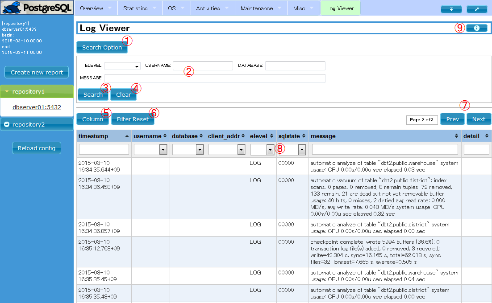

1.  [What is pg_stats_reporter](#What-is-pg_stats_reporter)
2.  [Online and Offline Reports](#Online-and-Offline-Reports)
3.  [Installation](#Installation)
    1.  [Environment](#Environment)
    2.  [Installing pg_stats_reporter](#Installing-pg_stats_reporter)
    3.  [Initial Setup](#Initial-Setup)
    4.  [Checking of Installation](#Checking-of-installation)
4.  [Usage](#Usage)
    1.  [Accessing Online Report](#Accessing-Online-Report)
    2.  [Generating Offline Report](#Generating-Offline-Reports)
5.  [Uninstallation](#Uninstallation)
6.  [Configuration File](#Configuration-File)
7.  [Cautions and Restrictions](#Cautions-and-Restrictions)
8.  [FAQ](#FAQ)
9.  [Changes from pg_stats_reporter13](#Changes-from-pg_stats_reporter13)
10. [See also](#See-also)
11. [Acknowledgments](#Acknowledgments)

# pg_stats_reporter 14

## What is pg_stats_reporter

pg_stats_reporter is a graphical report generator for
[pg_statsinfo](https://github.com/ossc-db/pg_statsinfo/).
It offers you various statistical information collected by pg_statsinfo
in a graphical and interactive representation. pg_stats_reporter 14 is
compatible only with pg_statsinfo 14. You can see an example report
[here](http://pgstatsinfo.sourceforge.net/documents/reporter14/html/files/report_sample.html).

pg_stats_reporter 14 and later are available on GitHub. pg_stats_reporter 13 and earlier can be found at [SourceForge](http://pgstatsinfo.sourceforge.net/index.html).

## Online and Offline Reports

pg_stats_reporter runs in two ways. It runs as a CGI script and
connects to repository server of pg_statsinfo in common usage but it
also provides a command-line interface to generate off-line reports,
which is portable form of the graphical report.

## Installation

RPM package is available
[here](https://github.com/ossc-db/pg_stats_reporter/releases).
If you would like to install from source, you will see instructions in
INSTALL.en file in the top of source tree.

### Environment

pg_stats_reporter is tested on the following environment.

  - pg_statsinfo
    version 14

  - PHP  
    version 5.4.16 (bundled with RHEL7), 7.2.24 (bundoled with RHEL8)

  - OS  
    RHEL 7.9, 8.5

  - Web browser  
    Firefox : 91.4.0esr, 96.0
    
    Microsoft Edge : 97.0.1072.55

  - HTTP Server  
    Apache HTTP Server : 2.4

  - libraries (These packages are included in the package of
    pg_stats_reporter)
    
      - jQuery : 3.6.0
      - jQuery UI : 1.13.0
      - jquery-ui-timepicker-addon : 1.6.3
      - dygraphs JavaScript Visualization Library : 2.1.0
      - jqPlot : 1.0.9 d96a669
      - tablesorter : 2.31.3
      - Superfish : 1.7.10
      - Smarty : 3.1.43

### Installing pg_stats_reporter

If you would like to use both of online and offline reports. You should
install all files required by both of CGI and command line part of
pg_stats_reporter. Following the steps below as a superuser will do
that. pg_stas_reporter is distributed as an RPM package but subsidiary
packages can be installed using yum.

#### Full Installation

The required packages are are installed by the steps like following
using yum.

##### RHEL7

    $ su
    # yum install pg_stats_reporter-14.0-1.el7.noarch.rpm php-intl

##### RHEL8

    $ su
    # dnf install pg_stats_reporter-14.0-1.el8.noarch.rpm php-intl

#### Installing for offline reports only

If you don't need online reports, some of the packages are not required.
Required packages for offline reports are installed by the steps like
following. pg_stats_reporter package depends on php so --nodeps needed
for this case.

\* The php-intl RPM package for Red Hat Enterprise Linux is available
via the subscription management services provided at Red Hat customer
portal. It is required to activate automatic language selection (only
instant help messages between ja/en) of an online graphical report.

##### RHEL7

    $ su
    # yum install php-pgsql php-intl php-cli
    # rpm -ivh --nodeps pg_stats_reporter-14.0.el7.noarch.rpm

##### RHEL8

    $ su
    # dnf install php-pgsql php-intl php-cli php-xml
    # rpm -ivh --nodeps pg_stats_reporter-14.0.el8.noarch.rpm

### Initial Setup

This section explains about required setups to run pg_stats_reporter.

#### Set up for the repository server to connect

Edit some fields in the configuration file so as to connect the
repository database. Configuration parameters are described
[later](#Configuration-File). [Sample configuration set
up](files/pg_stats_reporter.ini.sample) to connect to repository on
local server is included in package.

#### Start HTTP Service

Start the HTTP Service when you use online reporting. You may also have
to set up firewall and SELinux properly to allow pg_stats_reporter to
work.

    # systemctl start httpd.service

If you would like to run HTTP server at the next time you boot the
system, run the command below.

    # systemctl enable httpd.service

  

### Checking of installation

pg_stats_reporter works retrieving data from repository database of
pg_statsinfo. Please check if it is working beforehand.

You can confirm that pg_stats_reporter is properly installed by the
following steps. The repository server should have some content to show.

#### Checking whether online reporting works correctly

See [Accessing Online Report](#Accessing-Online-Report) and go to the URL as
explained there. The browser will come up with proper content if it is
working
well.

#### Checking whether offline (or command-line) reporting works correctly

See [Generating Offline Reports](#Generating-Offline-Reports) and list available
snapshots on command-line. The command gives some snapshot IDs if it is
working well.

## Usage

This section explain about the screen of online reports.

### Accessing Online Report

Entering the URL like following into address bar on your browser, you
will see initial screen like the next section.

    http://<hostname>/pg_stats_reporter/pg_stats_reporter.php

#### Operation details

Operations on GUI in detail are following.

##### Report screen

  

  - ① : Create new report button  
    Shows a popup to specify the period for new report. Details are
    shown in ["Create new report" dialog](#The-Create-new-report-dialog)
    section.
  - ② : Repository bar  
    One foldable list for one repository. Clicking the repository name
    toggles the instance (server) list inside to be expanded or
    collapsed.
  - ③ : Instance list  
    List of instances that the repository stores their statistics.
    Clicking an item selects it as the current instance for reporting.
  - ④ : Reload config  
    Tell pg_stats_reporter to reload the configuration file. If you
    made some changes in pg_stats_reporter.ini file, clicking this
    button makes the changes effective in the new report.
  - ⑤ : Menu  
    Jumps directly to the item selected in this page.
  - ⑥ : Go to top button  
    Jumps to the top of this page.
  - ⑦ : Toggle sidebar button  
    Shows or hides the sidebar alternatingly.
  - ⑧ : Help button  
    Shows help popup.

  

##### The "Create new report" dialog

  

  - ⑨ : Beginning of the report period  
    This field specifies the beginning date and time of the report
    period. You can fill it immediately or clicking it shows calendar
    widget to select date and time.
  - ⑩ : End of the report period  
    This field specifies the ending date and time of the report period.
    Calendar widget is also available for this field.
  - ⑪ : Create report  
    Finishes entering the period and make the new report.
  - ⑫ : Cancel  
    Cancels entering the period and close this dialog.

##### Log viewer

Different from other items, log viewer is shown in a dedicated frame.

  

① : Search Option button

Toggles folding state of the search option section just below.

② : Filter condition fields

You can filter out unnecessary logs from the table below by filling
these fields and click the "Search" button below.

  - ELEVEL: Message level
  - USERNAME: User name
  - DATABASE: Database name
  - MESSAGE: Regular expression that [PostgreSQL defines for SIMILAR
    TO](http://www.postgresql.org/docs/14/static/functions-matching.html).

③ : Search button

Start searching the repository for the filtered logs.

④ : Clear button

Empty all fields in the Search Option section.

⑤ : Column selector

Shows a dialog to select columns to be displayed in the result table.

⑥ : Filter Reset button

Clear all quick filter conditions.

⑦ : Page move buttons

Moves to the next or previous page.

⑧ : Quick filter

Quick filter for each column. Text fields accepts the [regular
expressions for
tablesorter](http://mottie.github.io/tablesorter/docs/example-widget-filter.html).

⑨ : Help button

Shows some help on this
    page.

  

### Generating Offline Reports

#### Generating Reports

    $ pg_stats_reporter [-R DBNAME] [-i INSTANCEID] [-a] [-O DIRECTORY] [-b SNAPID] [-e SNAPID] [-B DATE] [-E DATE]

The very simple example below generates an offline report from snapshots
in repository database named sample with default settings as following.

  - Report period is whole yesterday and until now.
  - Includes all targets registered.
  - Places the result in the current directory. Note that the report to
    be generated consists of several files and directories. The file
    index.html among them is the entry point of the whole of the report.

<!-- end list -->

    $ mkdir report
    $ cd report
    $ pg_stats_reporter -R sample
    $ ls
    css         js       sample_localhost_5432_1_20150528-0000_20150529-1650.html
    index.html  package

  - \-R, --repositorydb=DBNAME  
    Make a report connecting to the repository database with DBNAME.
    Default is the first reporsitory in configuration file.
  - \-i, --instid=INSTANCEID  
    Make a report only for the target instance of INSTANCEID. All
    instances stored in the repository database by default.
  - \-a, --all  
    Emit all report items ignoring default setting.
  - \-O, --outputdir=DIRECTORY  
    Place output files in the directory DIRECTORY. The default is to put
    in the current directory. If the directory does not exist, it will
    be created.
  - \-b, --beginid=SNAPID  
    Make a report for the period begins with the snapshot of SNAPID. The
    default behavior of this option is described below.
  - \-e, --endid=SNAPID  
    Make a report for the period ends with the snapshot of SNAPID. The
    default behavior of this option is described at the end of this
    section.
  - \-B, --begindate=DATE  
    Make a report for the period begins with DATE, in the format of
    "YYYY-MM-DD HH:MI:SS". The default behavior of this option is
    described at the end of this section.
  - \-E, --enddate=DATE  
    make a report for the period ends with DATE, in the format of
    "YYYY-MM-DD HH:MI:SS". The default behavior of this option is
    described at the end of this section.

<!-- end list -->

1.  Date specifications and Snapshot ID specifications are exclusive.
2.  If you specify only one end of report period, the opposite end is
    assumed to be the first, or the last of all snapshots.
3.  If both ends are omitted, the default report period begins yesterday
    midnight and lasts until now.

#### Listing snapshots

    $ pg_stats_reporter -l [-R DBNAME] [-i INSTANCEID]

The option "-l" instructs to do this. The following example lists all
snapshots stored in the repository database "sample".

    $ pg_stats_reporter -l -R sample

  - \-l, --list  
    Show the list of snapshots.
  - \-R, --repositorydb=DBNAME  
    List snapshots in the repository database DBNAME. Default is the
    first repository in configuration file.
  - \-i, --instid=INSTANCEID  
    List snapshots of the target instance of INSTANCEID. All instances
    stored in the repository database by default.

#### Listing target instances

    $ pg_stats_reporter -L [-R DBNAME]

The option "-L" instructs to do this. The following example command
shows the list of the all target instances stored in the repository
"sample".

    $ pg_stats_reporter -L -R sample

  - \-L, --dblist  
    List all of the target instances.
  - \-R, --repositorydb=DBNAME  
    List snapshots in the repository database DBNAME. Default is the
    first repository in configuration file.

#### Show snapshot size

    $ pg_stats_reporter -s [-R DBNAME]

The options "-s" instructs to do this. The example command below shows
the amount of disk space consumed by the snapshots in the repository
database "sample".

    $ pg_stats_reporter -s -R sample

  - \-s, --size  
    Show amount of disk space used by snapshots.
  - \-R, --repositorydb=DBNAME  
    List snapshots in the repository database DBNAME. Default is the
    first repository in configuration file.

#### Recreate index page

    $ pg_stats_reporter --index [-O DIRECTORY]

The options "--index" instructs to do this. The example command below
creates the index page of the reports stored in /var/report. Doing this
after you have deleted some reports updates the index page so as to
display the content correctly.

    $ pg_stats_reporter --index -O /var/report

  - \--index  
    Recreate index page of existing reports.
  - \-O, --outputdir=DIRECTORY  
    Make index page for directory DIRECTORY, defaults to the current
    directory.

## Uninstallation

pg_stats_reporter installed by RPM package is uninstalled by the
following steps. The configuration file ('/etc/pg_stats_repoter.ini')
is left alone by the steps, so you should delete it manually if it is
not necessary.  
\* You will see the instructions to uninstall manually in INSTALL.en in
the top source directory.

### RHEL7

    $ su
    # yum remove pg_stats_reporter-14.0-1.el7.noarch

### RHEL8

    $ su
    # yum remove pg_stats_reporter-14.0-1.el8.noarch

## Configuration File

All settings for pg_stats_reporter are described in the configuration
file "pg_stats_reporter.ini" in /etc directory, which is composed of
two main sections, global settings and per-repository database
settings.  
Multiple repositories can be defined in the configuration file. You can
choose one of them in the sidebar.

### Global settings

The section marker "\[global_setting\]" indicates the beginning of the
global settings. If you installed following instructions, you don't need
to change the settings here from the sample configuration
file.

| Parameter          | Type of value | Default value | Example                       | Description                                    |
| ------------------ | ------------- | ------------- | ----------------------------- | ---------------------------------------------- |
| install_directory | string        | mandatory     | install_directory = /var/www | Installation directory of this tool            |
| log_page_size    | 1 - 1000      | 1000          | log_page_size = 1000        | Maximum number of rows of the log viewer table |

### Per-repository settings

Every repository requires one section describing settings about it. The
section tag is the display name for the repository in the sidebar.

Available setting parameters are shown
below.

| Parameter              | Type of value          | Default value | Example                | Description                                                                                                                                                                                         |
| ---------------------- | ---------------------- | ------------- | ---------------------- | --------------------------------------------------------------------------------------------------------------------------------------------------------------------------------------------------- |
| \[*repository name*\]  | character              | mandatory     | \[repository 1\]       | Section marker for this repository. The name is displayed as repository name in the sidebar of web interface.                                                                                       |
| host                   | hostname or IP address | (\*a)         | host = localhost       | Hostname or IP address of the repository server.                                                                                                                                                    |
| port                   | port number            | (\*a)         | port = 5432            | Port number to connect to repository server.                                                                                                                                                        |
| dbname                 | string                 | (\*a)         | dbname = postgres      | Name of the repository database.                                                                                                                                                                    |
| username               | string                 | (\*a)         | username = postgres    | Name of the User to connect to the repository database.                                                                                                                                             |
| password               | string                 | no password   | password = foo-bar-baz | Password to connect to the repository server. Leave unspecified when .pgpass is used.                                                                                                               |
| language               | auto/ja/en             | auto          | language = ja          | Language for web interface. auto means that the language will be determined according to the browser's request. Assumed to be "en" if php-intl is not installed.                                    |
| Report items selection | true/false             | true          | summary = true         | Specifies whether to show or not for each report item. All report items should have their own settings. They are prewritten in the [sample configuration file](files/pg_stats_reporter.ini.sample). |

  

1.  These settings follow [PostgreSQL
    settings](http://www.postgresql.org/docs/14/static/libpq-connect.html#LIBPQ-PARAMKEYWORDS)
    as default.

## Cautions and Restrictions

This section provides important information that can affect stability
and information about what might be confusing. Be sure to read them
before use.

  - pg_stats_reporter might get confused if default timezone is not
    set in php.ini. It is recommended to set appropriate timezone.
  - The value "0" in rounded-off fields doesn't necesarily mean "nothing
    at all".
  - By a restriction of PHP, some characters cannot be used in section
    name, which is used as repository name on the Web UI. "/" for Linux
    and "\\ / : \* ? \< \> |" for Windows.
  - The section name "global_setting" is reserved by
    pg_stats_reporter so you cannot have a repository with the display
    name.
  - pg_stats_reporter may miss some queries in the Query Activity part
    of the report when too many queries were executed on unobserved
    databases on the instance during the snapshot period. This is due to
    the maximum number of queries that pg_stat_statements can trace.
    Likewise, many long queries executed on unobserved databases can
    push away the queries on observed databases.
  - Although pg_statsinfo is designed to exlclude databases specified
    by the parameter
    [excluded_dbnames](https://github.com/ossc-db/pg_statsinfo/)
    from snapshots, it fails for some report items such as "long
    transactions".

## FAQ

#### Q1. I can only see a blank page on browser when accessing online report.

A1. It might be caused by settings of firewall, SELinux or memory usage
limitation of PHP.

  - Configure firewall to allow http inbound access.

  - Set httpd_can_network_connect_db of SELinux configuration to on,
    and directories written by pg_stats_reporter should have the
    context of httpd_sys_rw_context_t. You can see the current
    setting by doing the following.
    
        getsebool httpd_can_network_connect_db
        ls -dZ /var/www/pg_stats_reporter_lib/{cache,compiled}

  - Increase the memory_limit parameter in /etc/php.ini as necessary
    then restart the http
server.

#### Q2. pg_stats_reporter shows an error dialog of connection failure to repository at the first connection.

A2. Repository connection settings in pg_stats_reporter.ini or access
control setting of the repository database might be wrong. Make sure
that they are correct.

#### Q3. My Internext Explorer displays the report but it looks broken.

A3. Use Firefox or Chrome instead. Internet Explorer is not recommended.

#### Q4. Can I run pg_stats_reporter on worker mode of Apache?

A4. Unfortunately, PHP is not recommended to be used on multithreaded
MPM and we tested pg_stats_reporter only on prefork
mode.

#### Q5. I see the name of a no-longer-monitored database in the repository bar.

A5. It is brought about by the data for such instances left in the
repository. You can remove such items by manually deleting the
corresponding data in repository. See details
[here](https://github.com/ossc-db/pg_statsinfo/).

#### Q6. Report seems displayed in somewhat broken format.

A6. Your browser may hold old JavaScript libraries in cache. Try
clearing them.

## Changes from pg_stats_reporter13

Changes from pg_stats_reporter 13 are shown below.

  - Supports pg_statsinfo 14 (pg_stats_repoter 14 supports only
    pg_statsinfo
14).
  - There is now more performance informatin to report.
    - Added report of pg_stat_wal. Report the amount of WAL read/write,
	  required time to read/write, and so on.
	- Added report the amount of WAL write while vacuuming, the number of
	  scanned, removed, and recycled pages while vacuuming on indexes.
    - Added report of pg_stat_replication_slots.
      Report the amount of transfered data when logical replication is used
      and disk I/O which wal_sender consume temporalily.

## See also

[pg_statsinfo 14](https://github.com/ossc-db/pg_statsinfo/)
  

## Acknowledgments

Pg_stats_reporter uses many libraries. We are deeply grateful to the
developers of these libraries.  

  - jQuery : <http://jquery.com/>
  - jQuery UI : <http://jqueryui.com/>
  - jquery-ui-timepicker-addon :
    <http://trentrichardson.com/examples/timepicker/>
  - dygraphs JavaScript Visualization Library : <http://dygraphs.com/>
  - jqPlot : <http://www.jqplot.com/>
  - tablesorter : <https://github.com/Mottie/tablesorter>
  - Superfish : <https://superfish.joelbirch.design/>
  - Smarty : <http://www.smarty.net/>

  
  

-----

[Top](https://github.com/ossc-db/) \>
[pg_stats_reporter](https://github.com/ossc-db/pg_stats_reporter/)

Copyright (c) 2012-2022, NIPPON TELEGRAPH AND TELEPHONE CORPORATION
